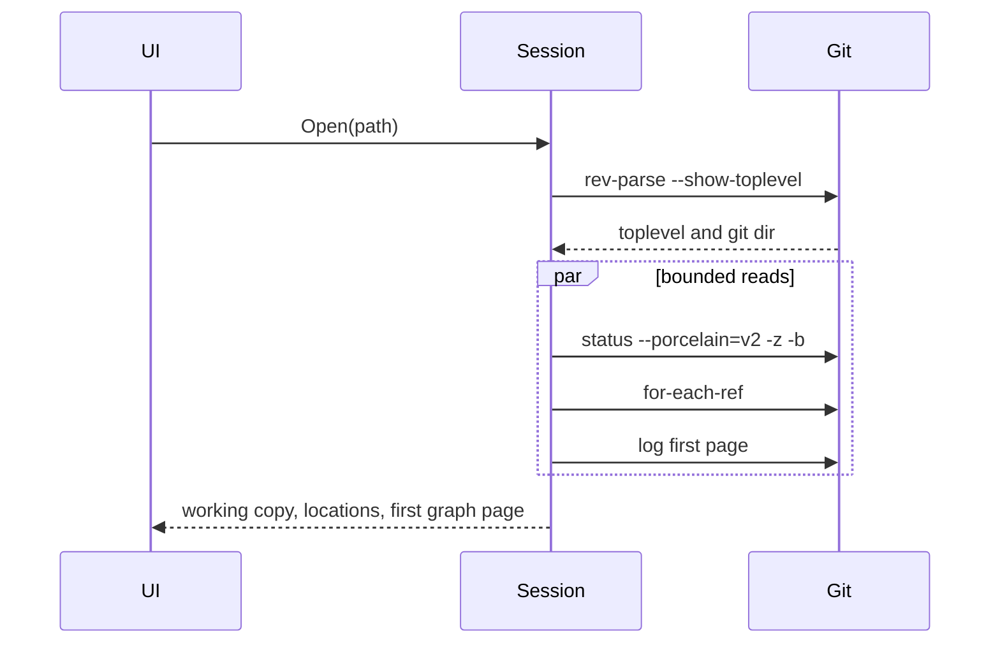

# Sextant

Cross-platform Git client. Performance is the first requirement. Working comfortably across several large repositories is the second. The day-to-day flow inside a repository follows Sublime Merge: locations, commit graph, files, diff, and the usual branch and sync actions.

The app is C# on .NET 10, Avalonia 12.1.3 with FluentTheme at compact density, and CommunityToolkit.Mvvm 8.4.2. It runs on Windows, Linux, and macOS. It uses the system `git` binary and that installation's configuration, hooks, attributes, and credential helpers.

## Status

- Plan saved: 2026-09-30
- Phase 1, daily loop: implemented, not yet clicked through
- Phase 2, history and local repair: implemented, not yet clicked through
- Phase 3, rewriting and conflicts: implemented, not yet clicked through. Continue and abort cover merge, rebase, cherry-pick, and revert. The working copy has the three-way editor. Interactive rebase, amend, and force-with-lease are in the app.
- Phase 4, scale and depth: implemented, not yet clicked through. Submodules and worktrees are listed and open as tabs. Sparse checkout is announced and excluded paths stay unmaterialized. Non-image LFS pointers stay pointers until the user asks. Visible diff lines are highlighted as they are realized. A line longer than 256 characters is split into rows so one long line does not stall the window. Image diffs, including LFS pointers under 8 MB, load both versions on their own, with a spinner while that load runs. The preview covers png, jpg, jpeg, gif, bmp, webp, ico, svg, tif, and tiff. An FBX file shows a fitted clay view of each version. Hold Ctrl or Cmd to turn that side: drag rotates, the wheel zooms, and a double-click returns the first angle. A plain wheel scrolls the diff. Under each view are the mesh, vertex, and triangle counts, the material names, and the animation takes. A historical LFS object for an image or FBX preview is downloaded. When the active GitHub account cannot see the repository, another account already signed in to gh is used for that download. The file list and diff headers mark a path tracked with Git LFS. Fetch LFS objects and Pull LFS files are on the Repository menu, and a working-copy file can be tracked, stopped, or downloaded.

Phase 1 code is in the app. `Sextant.Git.Tests` passed 36/36 against system git on 2026-09-30, including hunk stage/unstage, conflict abort, and push/pull to a local bare remote. The Windows app builds and starts. A throwaway repository was opened through the saved workspace, so open, status, and the first history page ran. The window follows the system light or dark variant. Opening a repository with no commits (a fresh local init, or an orphan branch) no longer treats the missing HEAD as a failure; history is loaded without that revision so other branches still show. Before the first commit, unstage and discard use `git rm` instead of `git restore`, and an untracked file's diff is read with `git diff --no-index`. Staging or unstaging a file keeps the working-copy file list at the same scroll position. The window and the Windows executable use the sextant mark in Assets/sextant.png and Assets/sextant.ico. The manual pass (two real repos, a conflict in the window, a commit with the machine's `user.name`, a credentialed fetch) has not been done. Linux and macOS have not been run.

Phase 2 is in the window as of 2026-10-01. The graph search box filters by subject, author, pasted sha, or `branch:name`, and a file's History action loads `git log` for that path. Blame, side-by-side, ignore-whitespace (`-w` for that view only), and an all-files diff are toggles on the diff. Line staging is available inline, and hunk staging covers added, untracked, and deleted text files as well as ordinary modifications. Selecting two commits shows the diff between them. Stash, tags, remotes, soft/mixed/hard reset, cherry-pick, and revert are in the locations list, the graph menu, or the toolbar. A conflicted cherry-pick or revert can be aborted; continue stays in Phase 3. Open, clone, and init are in the File menu and in the empty window. The saved-repository pane is gone: a repository is a tab, and a closed one is opened again from the file system. Open tabs still restore on startup. Inactive tabs stay unloaded until selected. The locations column is a virtualized tree: Branches, each remote, Tags, Remotes, and Stashes fold and unfold, and a refresh keeps that fold. Branch, remote-tracking, and tag names that share a `/` prefix are grouped under that prefix. Only rows on screen are created. The working copy has Stage all and Unstage all, and Commit is a split button whose menu action commits with `--no-verify`. `Sextant.Git.Tests` passed 59/59 against system git on 2026-10-01, and the Windows app builds with 0 warnings. The app was not launched for the pane removal, so the workspace file under `%APPDATA%\Sextant` was left as it is; the next real save omits the old pins list. Selecting a merge commit lists the files changed from its first parent, in one list reset, and the file list virtualizes those rows. `git show --name-status` on that merge is a combined diff and was empty: the World commit `Merge branch 'main' into audio/TBW-28368-CMS-Radios-KPDH` changes 19,959 files from its first parent and `git show` listed none. The patch of one file still loads on selection. The whole-commit patch stays behind the existing size cap until Load anyway. Each commit-graph row is two lines: the subject on the first, and the author, relative time, calendar date, short sha, and ref names on the second. The lane drawing fills that taller row. Windows CI is `.github/workflows/dotnet-desktop.yml`, from GitHub's .NET Desktop starter workflow. On push and pull request to master it runs on `windows-latest` with .NET 10, tests `Sextant.slnx`, publishes a self-contained win-x64 app, Authenticode-signs `Sextant.exe` and `Sextant.Git.dll` when the `Base64_Encoded_Pfx` and `Pfx_Key` secrets are set, and uploads that folder as an artifact. There is no MSIX packaging project. Tests that commit in a repository other than the fixture, including the push/pull clone, set that repository's own `user.name` and `user.email`. They do not use the machine's global identity, which a GitHub-hosted runner does not have. Phase 3 has started. A rebase is recognized from `rebase-merge` or `rebase-apply`, and Continue and Abort run `git merge --continue`, `git rebase --continue`, `git cherry-pick --continue`, `git revert --continue`, and the matching abort. Continue uses a no-op editor so git does not open one. An unmerged text file in the working copy opens in the three-way editor: ours, an editable result, and theirs, with the merge base on demand. Take ours and Take theirs fill that region. Save and stage writes the working-tree file and runs `git add` when the conflict markers are gone. If markers remain, the edit stays on disk and the path stays unmerged. A binary conflict stays on the external merge tool. `Sextant.Git.Tests` passed 71/71 against system git on 2026-10-01, and the Windows app builds with 0 warnings. The window was not launched. On 2026-10-01 the window theme is Avalonia's `FluentTheme` with `DensityStyle` Compact. That app build has 0 warnings, and the window was not launched for the switch. A diff is binary only when git's own notice is a line by itself (`Binary files … differ` or `GIT binary patch`). Markdown and source that mention those words stay text diffs. The toolbar is Pull, with Fetch in that split button, and Push beside it. Branch (Ctrl/Cmd+B), Stash (Ctrl/Cmd+Shift+S), Add remote, and Command log are in the Repository menu. History search is hidden until Repository → Search or Ctrl/Cmd+F. The window was not launched for this pass. The branch line is a centered rounded box with the local name, ahead/behind, and the running command. The upstream name is not shown there. The Phase 2 window has not been clicked through.

On 2026-10-01 the macOS build is a bundle. `dotnet build` and `dotnet run` use `src/bin/Debug/Sextant.app`, and `dotnet publish -r osx-arm64` writes `Sextant.app` (including when `-o` is set). The Dock icon is the sextant mark from `Assets/sextant.png`, installed as `Contents/Resources/sextant.icns`. The bundle id is `app.sextant.desktop`. Launch Services reported that id for a running build, and the main window opened at 1200×788. Command shortcuts use the Command key: Open is ⌘O, Branch ⌘B, Stash ⌘⇧S, Search ⌘F, the command palette ⌘P, close tab ⌘W, and commit ⌘↩. Next tab stays ⌃⇥, because ⌘⇥ is the macOS application switcher. A keystroke was not injected; this session cannot send Accessibility events. `Sextant.Git.Tests` passed 74/74 against system git on this Mac. The pre-commit hook fixture is marked executable, which git on macOS and Linux requires before it will run the hook. Windows CI was not run. The same `.github/workflows/dotnet-desktop.yml` file has a `build-macos` job on `macos-latest`. It tests, publishes a self-contained osx-arm64 `Sextant.app`, tars that bundle so the app host stays executable, and uploads `Sextant-osx-arm64.tar` with `actions/upload-artifact@v7` and `archive: false`. The download is that tar. The Windows job still uploads its publish directory with v4. A copy of that tar, extracted and moved to `/Applications`, was refused with “Sextant.app is damaged and can’t be opened.” The bundle was intact. The SDK had ad-hoc signed the apphost as a loose executable, so the bundle had no sealed resources (`code has no resources but signature indicates they must be present`). Managed assemblies were also mode `744`, which makes `codesign` treat those PE files as nested code. Chrome had set `com.apple.quarantine` on the download. `stamp-mac-app.sh` now clears that executable bit on non-Mach-O files and ad-hoc signs the bundle; `codesign --verify --strict` passes. The app is not notarized, so a browser download still needs `xattr -cr` before Gatekeeper will launch it. The installed copy was signed that way and quarantine was removed. The command log is a full-width read-only text field. It shows the last commands with stderr, the text scrolls and can be selected, and the right-click menu copies the selection or selects all. `Sextant.Git.Tests` passed 75/75 against system git. The window background uses the same Fluent chrome color as the locations list and the commit list, so the page is no longer pure black beside those lists. Pull runs `git pull --rebase`. Push is a split button: Push is the default, and Push ignoring local checks runs `git push --no-verify`. The window was not launched for this pass. Applying Speed up status writes `feature.manyFiles` and `core.fsmonitor` into that repository's `.git/config` in one pass. Closing the dialog no longer starts a focus refresh that drops the write. A later open of that tab does not ask again for a key that is already enabled. Not now still asks on the next slow status. `Sextant.Git.Tests` passed 76/76 against system git, and the app builds with 0 warnings. The window was not launched for this pass. Interactive rebase of the selected commits reorders, squashes, fixups, edits, drops, and rewords without opening an editor. A reword, and a squash with a typed message, are a pick or fixup plus `exec git commit --amend -F`. Amend is on the commit menu: `commit --amend -F` when the box has text, and `commit --amend -C HEAD` when it is empty. Push with force-with-lease is its own labeled action. The confirmation names commits already on the upstream, and a plain `--force` is not that button. `Sextant.Git.Tests` passed 84/84 against system git, and the app builds with 0 warnings. The window was not launched for this pass. Text in the working copy, a commit, blame, and the three-way editor can be selected and copied. That covers inline and side by side, and the selected file and all files. A drag selects across lines. Right-click copies the selection or selects that column. Ctrl/Cmd+C copies it and Ctrl/Cmd+A selects the column. The first version of that list drew no lines: the list subclass did not use the ListBox theme, so it never built an items presenter. The list and its rows now use the ListBox and ListBoxItem themes, and a headless render of the repository view showed the hunk header, the line text, both side-by-side columns, the file label, the blame columns, and the stage buttons. `Sextant.Git.Tests` passed 87/87 against system git, and the app builds with 0 warnings. The desktop window was not launched for this pass.

On 2026-10-01 Phase 4 is in the window. The locations list has a Submodules section and a Worktrees section when those exist. Open is on the row menu. An uninitialized submodule is not opened, and the app does not run `git submodule update`. Add worktree is in the Repository menu and the command palette. The folder must not exist yet. The new worktree is not opened automatically. There is no worktree remove. When `core.sparseCheckout` is on, a banner says excluded paths stay out of the working tree. Reading an excluded blob uses `git cat-file` and does not check the path out. Adding a worktree from a sparse parent uses `worktree add --no-checkout`, copies that parent's sparse patterns, then checks out the new worktree so only those patterns are materialized. `sparse-checkout set` alone leaves a `--no-checkout` worktree empty. An empty pattern list refuses the add. A normal diff passes `--no-textconv` and clears `filter.lfs.smudge`, `filter.lfs.process`, and `filter.lfs.required`, so a Git LFS pointer is shown as a pointer. An empty `diff.lfs.textconv` is not used: this git tries to spawn a blank program (`cannot spawn :`). Show the file is a separate action for a non-image pointer. Over 8 MB it returns before starting git. That download uses `git cat-file --filters` or `git lfs smudge` on stdin and does not write the working tree. `git cat-file --filters` does not take a type or a `--` separator. Syntax highlighting tokenizes one realized diff line in the view. A line longer than 256 characters is drawn as several rows, and copying them joins the original line back together. Blame and the three-way editor stay plain. An image diff covers png, jpg, jpeg, gif, bmp, webp, ico, svg, tif, and tiff. SVG is drawn to a PNG for that preview, with scripts left off and without fetching images or other files the document points at. TIFF shows the first page. A page above 16 megapixels, or with a side above 16384 pixels, is left unloaded. Both versions load on their own and sit side by side, including every image in an all-files diff. An LFS image under 8 MB is part of that load: both sides are fetched with no Show the file step. A revision uses `git cat-file --filters`. A pointer that is the worktree file is stored with `hash-object` and filtered with `--path`, then `git lfs smudge` on stdin if the filter did not return the image. None of that writes the working tree. Over 8 MB the preview stops before any smudge. A renamed image loads the previous path on the before side. Each image row shows a spinner and “Loading…” while its versions are still in flight. The spinner waits a moment before it appears, so a preview that is already on disk stays steady. Selecting another file keeps the new row’s spinner. `Sextant.Git.Tests` passed 110/110 against system git, and the Windows app builds with 0 warnings. The desktop window was not launched for this pass. Create branch asks for a name and then runs `git switch -c`. Closing that dialog activates the window, and the focus refresh was taking the busy flag before git ran, so the branch was never created. That refresh now stays out of the way until the confirmed command has started. The same guard covers the other dialogs that confirm a git command. `Sextant.Git.Tests` passed 112/112 against system git, and the Windows app builds with 0 warnings. The desktop window was not launched for this pass. Repository paths follow directory symlinks. git on the macOS runner lists a worktree as `/private/var/...` while the temp path is `/var/...`, and those are the same directory. `Sextant.Git.Tests` passed 113/113 against system git on Windows. The macOS worker was not run from here. The desktop window was not launched for this pass. A highlighted diff row drew some lines twice, the plain text beside the syntax-colored text. Avalonia copies a text block's plain text into the run list when that text is still set, which happens once a row is realized and then highlighted. The row clears that text before it builds the runs. Right-clicking a branch that is not checked out offers `Merge <that branch> into <current>` and `Rebase <current> onto <that branch>`, for a local branch and for a remote-tracking branch. The checked-out branch does not show them. Rebase runs `git rebase` and does not open an editor. `Rebase_replays_the_current_branch_onto_the_named_branch` passed against system git. The Windows app builds with 0 warnings. The desktop window was not launched for this pass. A remote-tracking branch, such as one under origin, has Delete. That asks, then runs `git push <remote> --delete <branch>`. If the branch is not contained in HEAD, a second confirmation is the force delete and the same push runs. `Delete_remote_branch_removes_it_from_the_remote` passed against system git. The Windows app builds with 0 warnings. The desktop window was not launched for this pass. Selecting a location no longer shows action buttons under the list. Checkout, merge, rebase, delete, and the other row actions stay on the right-click menu. Double-click still checks out a branch, opens a worktree or submodule, or shows a commit in the graph. The Windows app builds with 0 warnings. The desktop window was not launched for this pass. Merge and rebase on the locations menu are only for a local branch that is not checked out. A branch under origin, or under any other remote, does not show them. Checkout, delete, and show in graph stay on that menu. The Windows app builds with 0 warnings. The desktop window was not launched for this pass. An FBX diff loads both versions, up to 8 MB, and draws a fitted clay still of each mesh in the before/after image row. Under each still are the mesh, vertex, and triangle counts, the material names, and the animation takes. Assimp reads the file. A file it cannot read shows that error on the row. `Sextant.Git.Tests` passed 120/120 against system git. The Windows app builds with 0 warnings. The desktop window was not launched for this pass. An LFS preview downloads the object. When the active GitHub account cannot see the repository, the download is tried again with the other accounts already signed in to gh, and the account that works is kept for the rest of the session. The active gh account is left as it is. `Sextant.Git.Tests` passed 123/123 against system git. The Windows app builds with 0 warnings. The desktop window was not launched for this pass. On 2026-10-02 each FBX side can be turned on its own. Drag rotates it, the wheel zooms, and a double-click returns the three-quarter view. A new angle is drawn off the UI thread, and an image in that same row stays still. `Sextant.Git.Tests` passed 124/124 against system git. The Windows app builds with 0 warnings. The desktop window was not launched for this pass. The window remembers its size, position, and maximized state for every repository. Each repository keeps its own locations, graph, and files sizes. Tabs can be dragged into a new order. Ctrl/Cmd+1 through Ctrl/Cmd+9 activate those tabs, and Ctrl/Cmd+0 activates tab 10. `Sextant.Git.Tests` passed 125/125 against system git. The Windows app builds with 0 warnings. The desktop window was not launched for this pass. Pane sizes are stored on the repository, not on the window. Resizing the locations column, the graph, or the files list in one tab leaves the other repositories as they were. The window size, position, and maximized state stay shared. `Sextant.Git.Tests` passed 126/126 against system git. The Windows app builds with 0 warnings. The desktop window was not launched for this pass. In the all-files diff, each file name is a full-width rounded header with its own background and a light stroke. Clicking a file in the list scrolls that header to the top. A file already in the open diff is not loaded again. `Sextant.Git.Tests` passed 127/127 against system git. The Windows app builds with 0 warnings. The desktop window was not launched for this pass. All files is the diff that opens. Each file header folds and unfolds that file, and Expand all and Collapse all do the same for every file. Choosing a file opens it and scrolls its header to the top. Side by side, ignore whitespace, and the git executable are chosen in Settings → Settings. An empty git path uses the git executable on PATH. Blame stays above the diff, and Show base and Save and stage stay there while a merge is open. `Sextant.Git.Tests` passed 127/127 against system git. The Windows app builds with 0 warnings. The desktop window was not launched for this pass. Clicking a file name in the all-files diff, including the name on an image preview, folds and unfolds that file. Right-clicking it copies the file name, the repository path, or the full path, opens its folder in File Explorer, Finder, or the system file manager, and opens the file in the application registered for its type. `Sextant.Git.Tests` passed 135/135 against system git. The Windows app builds with 0 warnings. The desktop window was not launched for this pass. A drag that starts on a tab's label reorders that tab. A click on the label without a drag selects it. The close button does not start a drag. The Windows app builds with 0 warnings. The desktop window was not launched for this pass. Each tab has a border on the left, top, and right, and padding between that border and the label. The repository pane has a top border that stops under the selected tab. The Windows app builds with 0 warnings. The desktop window was not launched for this pass. Every repository tab shows a dot. Orange means the working tree has changes. Red means a merge, rebase, cherry-pick, or revert is in progress. Green means none of those are waiting. The Windows app builds with 0 warnings. The desktop window was not launched for this pass. In a side-by-side diff, one horizontal scrollbar moves both columns together, so a line wider than the column can be read. The vertical wheel scrolls the diff. Shift+wheel, and a sideways wheel, move that bar. The Windows app builds with 0 warnings. The desktop window was not launched for this pass. A hunk row is a full-width rounded bar with the same background and light stroke as a file header. Stage hunk and Unstage hunk sit on the right of that bar and use the accent color. The Windows app builds with 0 warnings. The desktop window was not launched for this pass. Copy filename takes the last path segment when the repository path uses backslashes, on macOS and Linux as well as Windows. DesktopOpenTests passed 8/8 on Windows. The macOS worker was not run from here. An empty window centers the application icon, the name Sextant, and "Open a repository to start." Open, Clone, and Init each sit in a column, with a short explanation under the button. The Windows app builds with 0 warnings. The desktop window was not launched for this pass. The Fluent palette is Catppuccin Latte in light and Catppuccin Mocha in dark. Settings chooses light, dark, or follow the system. The choice is saved in settings.json. The Windows app builds with 0 warnings. The desktop window was not launched for this pass. The menu is a native menu. On macOS it is the menu bar at the top of the screen, with Settings under the Sextant application menu. On Windows, and on a Linux desktop that does not provide a global menu, the same menu is drawn at the top of the window. The Windows app builds with 0 warnings. The desktop window was not launched for this pass. Loading a changelist in the all-files diff starts with every file collapsed. The working copy, the index, a commit, and a range each keep their own folds until a different changelist is loaded. The Windows app builds with 0 warnings. The desktop window was not launched for this pass. A fetch records how every local branch compares with its upstream. The branch row and the worktree row show ↓ when upstream has commits that branch does not, and ↑ when that branch has commits upstream does not. A local branch that is not the one checked out in this worktree is included. A remote-tracking branch, and a local branch with no upstream, are left out. `Fetch_marks_upstream_commits_on_local_branches` passed against system git. The app builds with 0 warnings. The desktop window was not launched for this pass. The command palette lists Fetch all, which runs `git fetch --all --progress`, and Fetch all and clean up, which runs `git fetch --all --prune --progress`. The same two items sit under Fetch on the Pull button. Plain Fetch stays `git fetch --progress` and still does not force a prune. `Fetch_all_reads_every_remote_and_prune_drops_a_deleted_branch` passed against system git. The app builds with 0 warnings. The desktop window was not launched for this pass. `Image_pointer_preview_loads_both_versions_and_leaves_the_worktree` and `Lfs_preview_retries_with_another_signed_in_github_account` were removed. Both drove a git filter through PowerShell, which is not installed on this Mac. The working-copy diff now includes untracked files. `git diff` leaves them out, so a working copy whose only change was a new file showed an empty diff while the graph still showed the last commit. A new file inside an untracked directory is included too. The staged diff does not list them. `Worktree_diff_includes_untracked_files_and_not_the_last_commit` passed against system git. The app builds with 0 warnings. The desktop window was not launched for this pass. Image and FBX previews on macOS failed with “could not be downloaded” because a Finder launch does not put Homebrew on PATH, so `git cat-file --filters` could not run `git-lfs`. Git now starts with its own directory, `/opt/homebrew/bin`, and `/usr/local/bin` on PATH. “command not found” is no longer reported as a GitHub account problem. The app builds with 0 warnings. The desktop window was not launched for this pass. PATH entries are stored with the platform directory separator, and the list is joined with `Path.PathSeparator`. `Git_directory_is_first_and_is_not_repeated` passed against that. The desktop window was not launched for this pass. On 2026-10-03 image and FBX previews sit in the diff list in file order, in the same scroll as the text. Expand all scrolls through every file. A picture is much taller than a line, so the diff's scroll extent is the sum of each row's height, measured when that row is on screen and estimated from its kind until then. A headless layout showed the preview between the files around it, kept the list virtualized, and realized the last file. `Sextant.Git.Tests` passed 138/138 against system git, and the app builds with 0 warnings. The desktop window was not launched for this pass. On 2026-10-03 each text diff shows line numbers on the left. An inline row has the old number and the new number. A side-by-side row has the old number on the left of the old column and the new number on the left of the new column, and those numbers stay put when the columns scroll sideways. A wrapped line keeps the number on its first row. A new file leaves the old number blank, and a loaded file numbers its lines from 1. `Sextant.Git.Tests` passed 143/143 against system git, and the app builds with 0 warnings. A headless layout showed the numbers to the left of the text. The desktop window was not launched for this pass. On 2026-10-03 blame uses the same file sections as the diff. Each file is a rounded header that folds, and Expand all and Collapse all apply. The selected file opens. The code is highlighted with the same rules as a diff line. A file that is still folded is not blamed until it opens. `Sextant.Git.Tests` passed 143/143 against system git, and the app builds with 0 warnings. A headless layout showed the file header above a highlighted blame line. The desktop window was not launched for this pass. On 2026-10-03 the diff and the blame are two tabs. The Diff tab stays selected while a merge is open. Expand all and Collapse all stay on the diff tab. `Sextant.Git.Tests` passed 143/143 against system git, and the app builds with 0 warnings. A headless layout showed the two tabs side by side and hid those actions on the blame tab. The desktop window was not launched for this pass. On 2026-10-03 a text diff and a blame use AvaloniaEdit with TextMate coloring. Each hunk, loaded file, or blame file is one read-only editor. The diff list stays the only vertical scroll, and the editor shows the slice that is on screen. Images and FBX stay in that same list, in file order. Line numbers, the blame author, and the stage-line action stay in the left margins. Added and removed lines keep their background. `Sextant.Git.Tests` passed 143/143 against system git, and the app builds with 0 warnings. A headless layout showed TextMate colors on a C# line, the picture in the same scroll, two side-by-side editors, a blame margin, and a vertical wheel that moves the list. The desktop window was not launched for this pass. On 2026-10-03 the history search accepts `file:` patterns. `file:*.fbx` and `file:CodeFile*Asset.cs` match that name in any directory. `file:SomeFile.md` does the same, and a pattern that contains a slash is a path. `Sextant.Git.Tests` passed 144/144 against system git, and the app builds with 0 warnings. The desktop window was not launched for this pass. Expand all and Collapse all, shown under the Diff tab when a diff has several files, sit on a command bar with a chevron and the label beside each action. The app builds with 0 warnings. The desktop window was not launched for this pass. Unity text assets keep their own suffix and are highlighted as the format Unity writes: materials, prefabs, scenes, and the other YAML assets as YAML, assembly definitions and shader graphs as JSON, UI Toolkit documents as XML, and USS style sheets as CSS. `Syntax_covers_the_visible_line_only` passed, and the app builds with 0 warnings. The desktop window was not launched for this pass. The branch box under the tabs is at least 210 wide, a quarter more than before, and the command in progress can use the free space beside Pull and Push before it is cut off. The app builds with 0 warnings. The desktop window was not launched for this pass. On 2026-10-03 an FBX preview takes the pointer only while Ctrl or Cmd is held. A plain wheel scrolls the diff, and a plain click does not leave that row focused. Dragging, the wheel, and a double-click turn, zoom, and reset the model only with that key held. Releasing the button or the key gives focus back. A headless window confirmed the plain wheel moves the list, Ctrl and Cmd wheels stay on the model, and focus returns to the control that had it before the click. The rendered frame was not available in that headless pass, so the new angle itself was not seen. The app builds with 0 warnings. The desktop window was not launched for this pass. On 2026-10-03 View → Toggle branch view hides and shows the locations column, and the command palette lists the same command. The column comes back at its previous width. A saved layout that does not mention the flag stays visible. A headless window confirmed the column and its splitter collapse and return. `Workspace_round_trip_preserves_tabs_and_settings` and `Pane_sizes_are_stored_per_repository` passed. The app builds with 0 warnings. The desktop window was not launched for this pass. On 2026-10-03 an unmerged text file opens in three editors: ours, an editable result, and theirs. Previous and Next move between conflicts. Take ours and Take theirs fill the selected conflict. The base is a fourth column. Save and stage writes the file and runs git add when the markers are gone. Syntax follows the file. Settings is split into Appearance, Diff, Git, and Merging. An external merge command is a Sextant setting. An empty command uses the merge tool configured in git. A command is passed only to that `git mergetool` run, with `mergetool.keepBackup=false`, and is not written into git config. `trustExitCode` stays unset. `Sextant.Git.Tests` passed 150/150 against system git. A headless window confirmed the editor, the conflict buttons, the base column, and settings validation. The app builds with 0 warnings. The desktop window was not launched for this pass. On 2026-10-04 a custom merge command sets `mergetool.sextant.trustExitCode=true` for that run. macOS compares the merged file's time in whole seconds, so a command that finishes in the same second was reported as `merge of a.txt failed` and the file stayed unmerged. The command's exit code now decides. `Custom_mergetool_stages_the_file_that_command_writes`, `Custom_mergetool_that_fails_leaves_the_conflict`, and `Mergetool_uses_git_config_until_a_command_is_set` passed. The desktop window was not launched for this pass. On 2026-10-04 a merge, rebase, cherry-pick, or revert with no external merge tool opens the in-app editor on the first conflicted text file, including while All files is the diff. The editor is the three Avalonia text editors already used for ours, the result, and theirs. A settings command, or git's `merge.tool`, still runs `git mergetool`. `Mergetool_uses_git_config_until_a_command_is_set` covers that choice. The desktop window was not launched for this pass. Discarding the last file in the working copy crashed while All files was the diff: the merge check read the selected file after that file was gone. An empty list now reloads the diff. The app builds with 0 warnings. The desktop window was not launched for this pass. Discard all sits on the right of Stage all and Unstage all, in line with the file actions. It restores tracked edits and removes untracked files. Conflicted files stay. A confirmation is required. `Discard_all_restores_tracked_files_and_removes_untracked_ones`, `Discard_all_before_the_first_commit_removes_the_new_files`, and `Discard_all_during_a_conflict_leaves_the_unmerged_path` passed against system git. The desktop window was not launched for this pass. On 2026-10-04 right-clicking a commit offers Cherry pick commit, Revert commit, and a Create menu: Create branch at commit, Create tag at commit, and Patch. Create branch at commit runs `git branch` at that commit and leaves HEAD where it is. Patch saves `git format-patch -1 --stdout` through a file dialog. Checkout, copy SHA, reset, interactive rebase, and reword stay on that menu. Create branch at HEAD stays on the working-copy row. `Reads_use_no_optional_locks_and_writes_do_not` and `Branch_at_a_commit_stays_put_and_a_patch_is_that_commit` passed against system git, and the app builds with 0 warnings. The desktop window was not launched for this pass. On 2026-10-04 a right-click anywhere on a commit row, a branch row, or a file row opens that row's menu. The menu target fills the row, including the space past the text. The app builds with 0 warnings. The desktop window was not launched for this pass. On 2026-10-04 a tag row offers Create branch from tag, Checkout tag, Push tag, Delete tag, and Delete tag from origin. Create branch from tag runs `git branch` and leaves HEAD where it is. Checkout runs `git switch --detach`. Push and the origin delete use the remote named origin. `Branch_from_a_tag_stays_put_and_checkout_detaches_there` and `Push_tag_publishes_it_and_delete_from_origin_removes_it` passed against system git, and the app builds with 0 warnings. The desktop window was not launched for this pass. On 2026-10-04 Repository → Apply patch and the command palette item “Apply patch” ask for a `.patch` or `.diff` file and run `git apply` on the working tree. The change stays unstaged. A patch saved from a commit applies as its diff, and the command does not run `git am`. `Apply_patch_uses_a_saved_commit_patch_and_leaves_it_unstaged` and `Apply_patch_refuses_a_diff_that_does_not_match` passed. `Sextant.Git.Tests` passed 158/158 against system git, and the app builds with 0 warnings. The file picker was not opened. The desktop window was not launched for this pass. On 2026-10-04 the file list and diff headers mark a path when `git check-attr` reports `filter=lfs`, and the tooltip says when it is not tracked. Repository → Fetch LFS objects and Pull LFS files, and the same command palette items, download objects. A working-copy file can be tracked, stopped, or downloaded. Track stages `.gitattributes` and the file. Stop tracking stages `.gitattributes` only. A file name that contains a comma cannot be one `--include` entry, so Download confirms, fetches the commit's LFS objects, and checks out only that file. `Check_attr_keeps_only_lfs_filters`, `Lfs_attribute_marks_the_worktree_and_a_commit`, `Track_with_lfs_stores_a_pointer_and_download_restores_the_file`, and `Download_of_a_comma_name_restores_that_file_only` passed. `Sextant.Git.Tests` passed 162/162 against system git, and the app builds with 0 warnings. A headless window showed the mark on a tracked file and a tracked diff header and hid it on an untracked path. The desktop window was not launched. On 2026-10-04 a published build includes `sextant.desktop` and `sextant.png` beside the executable. On Linux, the first launch copies that desktop file into `$XDG_DATA_HOME/applications`, or `~/.local/share/applications` when the variable is unset, if `sextant.desktop` is not already there. Exec and TryExec become the path that was launched, and the icon is the absolute path of the png beside that executable. An entry that is already installed is left as it is. Windows and macOS do not install one. `Applications_directory_follows_xdg_data_home`, `Exec_quotes_spaces_and_escapes_desktop_metacharacters`, `Launch_path_replaces_exec_tryexec_and_a_relative_icon`, `Shipped_desktop_file_uses_the_launched_executable`, and `Install_copies_once_and_leaves_an_existing_entry` passed. `Sextant.Git.Tests` passed 167/167 against system git, and the app builds with 0 warnings. `dotnet publish` included both files. `desktop-file-validate` accepted the shipped file and the installed form. The desktop window was not launched. On 2026-10-04 Open in File Manager and Open in editor on a diff header call `xdg-open` with the path alone. `xdg-open -- <path>` exits with “unexpected option '--'” and the menu looked idle. `Reveal_selects_the_file_in_the_file_manager`, `Open_directory_uses_the_file_manager`, and `Edit_uses_the_application_registered_for_the_file` passed. `Sextant.Git.Tests` passed 167/167 against system git, and the app builds with 0 warnings. The desktop window was not launched. On 2026-10-04 the Linux desktop-file tests compare the quoted full path instead of a hard-coded `/opt` path. On Windows, `Path.GetFullPath` rewrites `/opt/Sextant/Sextant`, and `Exec` escapes backslashes, so the old assertions did not match the written file. `Launch_path_replaces_exec_tryexec_and_a_relative_icon`, `Shipped_desktop_file_uses_the_launched_executable`, and `Install_copies_once_and_leaves_an_existing_entry` passed. `Sextant.Git.Tests` passed 167/167 against system git. The desktop window was not launched. On 2026-10-04 the Phase 2, Phase 3, Phase 4, and core grab-bag test classes are split by subject, Windows, Linux, and macOS tests compile only on that operating system alongside the shared suite, `Sextant.Git.Tests` passed 167/167 against system git on Linux, and the desktop window was not launched. On 2026-10-05 the test project references the app, Sextant exposes its internals to `Sextant.Git.Tests`, the per-file source links are gone, `Sextant.Git.Tests` passed 167/167 against system git on Linux, the app builds with 0 warnings, and the desktop window was not launched. On 2026-10-05 double-clicking a branch in the checkout dialog selects that branch and closes the dialog, and Enter on the selected branch does the same. Merge and the upstream pickers use that same list. `Sextant.Git.Tests` passed 167/167 against system git on Linux, the app builds with 0 warnings, and the desktop window was not launched. On 2026-10-05 Enter in that list still did nothing, because the row marks Enter handled when it selects. The dialog now accepts that handled Enter as OK, and Escape cancels. `Sextant.Git.Tests` passed 167/167 against system git on Linux, the app builds with 0 warnings, and the desktop window was not launched. On 2026-10-05 a clean working copy keeps the LFS clean filter on an unstaged diff, and that diff still passes `--no-textconv`. The files already on disk stay an empty diff, so the pointer sha256 notice stays out of the diff view. Staged diffs, ranges, show, and blame still clear the smudge and process filters. On WarGrid a stale index stat named 4156 LFS files when those filters were cleared; with the clean filter those names are absent. `Clean_lfs_worktree_is_not_a_pointer_diff` passed. `Sextant.Git.Tests` passed 168/168 against system git on Linux, the app builds with 0 warnings, and the desktop window was not launched. On 2026-10-05 the repository error bar is at most eight rows tall. A longer Git error scrolls inside the bar. Copy keeps the full message, and Dismiss stays on the first row. The LFS notice above a diff uses the same cap. A headless layout showed a 400-line error at 168 pixels, with Dismiss and Pull on screen, and a one-line error at a single row. `Sextant.Git.Tests` passed 168/168 against system git on Linux, the app builds with 0 warnings, and the desktop window was not launched. On 2026-10-05 checking out a remote-tracking branch creates that local branch with `git switch -c <name> --track <remote>/<name>` when no local branch has the name and otherwise checks out the local branch that already exists, the checkout passes `GIT_LFS_SKIP_DOWNLOAD_ERRORS=1` only in that command's environment so a missing LFS object stays a pointer and a cached object is still written out, `Remote_branch_checkout_creates_a_local_branch_or_uses_the_one_that_exists` and `Remote_checkout_keeps_a_cached_lfs_file_and_leaves_a_missing_one` passed, `Sextant.Git.Tests` passed 170/170 against system git on Linux, the app builds with 0 warnings, and the desktop window was not launched. On 2026-10-05 checkout sets `GIT_LFS_SKIP_SMUDGE=1` for the switch so Git LFS does not ask the credential helper, which had left Checking out stuck, and then runs `git lfs checkout` to write objects already in the local store while a missing object stays a pointer, `Remote_checkout_keeps_a_cached_lfs_file_and_leaves_a_missing_one` passed, `Sextant.Git.Tests` passed 170/170 against system git on Linux, the app builds with 0 warnings, and the desktop window was not launched. On 2026-10-05 `build-macos` maps `APPLE_CERTIFICATE_BASE64`, `APPLE_CERTIFICATE_PASSWORD`, `APPLE_TEAM_ID`, `APPLE_API_KEY_ID`, `APPLE_API_ISSUER`, and `APPLE_API_KEY` onto the sign step. When the certificate secret is set, `src/tools/notarize-mac-app.sh` imports that Developer ID Application certificate, signs `Sextant.app` with the hardened runtime and a timestamp, notarizes a zip, and staples the ticket before the tar. An empty certificate secret leaves the ad-hoc signature from `stamp-mac-app.sh`. Local `dotnet build` stays ad-hoc. The desktop window was not launched. On 2026-10-05 `security import` rejected the `.p12` with “the passphrase you entered is not correct” when `APPLE_CERTIFICATE_PASSWORD` ended in a newline. The sign script now removes a line break around that password before importing. A password that still does not open the file fails the job with that reason. The desktop window was not launched. The same import error remained after that trim. OpenSSL now opens the `.p12`, and when the password is valid the script rewrites it with a SHA-1 MAC and 3DES so `security import` can read it. A real mismatch prints `Mac verify error: invalid password?`. A `.cer` in the certificate secret is reported as a certificate. The desktop window was not launched. On 2026-10-05 a tag named like `v0.1.1` runs the Windows and macOS builds, then publishes a GitHub release titled Sextant plus that tag. The assets are `Sextant-osx-arm64.tar` and `Sextant-win-x64.zip`. Branch pushes and pull requests still build and do not publish a release. The desktop window was not launched. The release workflow is `.github/workflows/release.yml`. A tag push runs that file, which calls `.github/workflows/dotnet-desktop.yml` and then publishes the release. The desktop window was not launched. The pack step reads every name in `Sextant-win-x64.zip` and accepts the archive when `Sextant.exe` is a root entry. It reads the whole macOS tar listing before it checks that `Sextant` is executable. The desktop window was not launched. On 2026-10-05 a dialog that asks for a value focuses its first field when it opens. Create branch, clone, rename, checkout, and the other prompts put the caret there, and text already in the field is selected. Settings opens on the chosen appearance option. A headless window confirmed the caret, the selection, the clone URL, the branch list, and that settings option. The desktop window was not launched. On 2026-10-06 hiding every other branch limits the history to commits on that branch: the log follows --first-parent, each merge keeps only its first parent so the graph stays on one lane, and while any branch is hidden refs/remotes/*/HEAD is excluded before --remotes; Sextant.Git.Tests passed 194/194 against system git on Linux, the app builds with 0 warnings, and the desktop window was not launched. On 2026-10-06 selecting a commit shows its message, including the body, and its full hash, author, and date in read-only text fields that can be selected and copied; a headless window confirmed those fields and that the working-copy commit box stays editable, Sextant.Git.Tests passed 196/196 against system git on Linux, the app builds with 0 warnings, and the desktop window was not launched. On 2026-10-06 the hash, author, and date of a selected commit are single lines with no border, and the commit message is the last field above the diff; a headless window confirmed that order and that those three fields draw no border, Sextant.Git.Tests passed 196/196 against system git on Linux, the app builds with 0 warnings, and the desktop window was not launched. On 2026-10-06 the commit message sits under the hash, author, and date and above the Changes file list; a headless window confirmed that order, Sextant.Git.Tests passed 196/196 against system git on Linux, the app builds with 0 warnings, and the desktop window was not launched. On 2026-10-06 a selected commit shows a stats row above the message, such as 18 files changed with a red pill for the removed lines and a green pill for the added lines, counted from the same first-parent diff as the file list; a headless window confirmed the row, the pill colors, and that order, Sextant.Git.Tests passed 198/198 against system git on Linux, the app builds with 0 warnings, and the desktop window was not launched. On 2026-10-06 file history and an applied search show a close button beside the caption. The button is the accent color, with an X. The button, and Escape when the search box is not focused, restore the commit graph. Hidden branches stay hidden. A headless window opened file history, clicked Back, and confirmed the other commits returned; Escape from the graph did the same. A caption that only says which branches are hidden does not show Back. `File_history_back_restores_the_graph`, `File_history_lists_commits_that_touch_the_path`, `Hidden_branches_drop_commits_reached_only_from_those_branches`, and `Escape_in_the_search_box_hides_it_and_clears_the_text` passed. The Windows app builds with 0 warnings. The desktop window was not launched for this pass. On 2026-10-06 switching to a repository tab that is already open refreshes that repository the same way focusing the window does. Status and refs are read again, and history is read again when the branch tips changed. The first time a tab is selected it is loaded, and that load is the refresh. `Switching_to_a_tab_refreshes_that_repository` passed. The desktop window was not launched. On 2026-10-06 expanding or collapsing a file in a staged or unstaged diff keeps every file header on the same left edge. A header that is reused for the diff text no longer keeps that text row's padding. A file name that cannot fold still starts where the folding names do. `File_headers_keep_one_left_edge_when_a_file_expands` passed. The desktop window was not launched. On 2026-10-06 Expand all is Ctrl+Shift+E, and Collapse all is Ctrl+Shift+C. On macOS those are Cmd+Shift+E and Cmd+Shift+C. The shortcuts run only while those buttons are shown, on an all-files diff. `Expand_and_collapse_all_follow_the_keyboard` passed. The desktop window was not launched. On 2026-10-06 the Commit button and its menu stay disabled until a file is staged. Amend needs a staged file. `Commit_stays_disabled_until_a_file_is_staged` passed. The desktop window was not launched.

On 2026-10-06 the repository adds the Sextant License. Building from source is free, and so is installing a release published on GitHub. Official pre-built binaries for Windows and macOS are sold by Marcus Grenängen. The desktop window was not launched.

On 2026-10-06 Help → About Sextant opens a dialog with the version, the copyright, and the license. Help is on the window menu, so macOS shows it in the screen menu bar. The desktop window was not launched.

On 2026-10-05 a local or remote-tracking branch row offers Hide branch and Hide all other branches. Show branch and Show all branches bring them back. The commit graph then starts only from the branches still shown, so a commit no visible branch reaches is left out. A tag or a stash does not bring that commit back while a branch is hidden. The choice is saved with that repository. `Hidden_branches_drop_commits_reached_only_from_those_branches` passed against system git. The desktop window was not launched.

On 2026-10-05 the locations list keeps a Stashes root and a Submodules root when those lists are empty. Each label includes the count, so an empty repository shows Stashes (0) and Submodules (0). A stash or a submodule is still a row under that root. `Stashes_and_submodules_stay_visible_when_empty` and `A_submodule_is_a_row_under_the_submodules_root` passed against system git. A headless window confirmed the empty labels, a stash row under Stashes, and a submodule row under Submodules. The desktop window was not launched.

On 2026-10-05 the locations column is titled Locations. A search icon on the right opens a filter field, and the text hides branches, remote-tracking branches, tags, stashes, and the other rows that do not match. Escape or the icon again clears it. Each local branch, remote-tracking branch, and stash has an eye that hides or shows that row in the commit list. The row stays, dimmed, and the choice is saved with the repository. A stash is remembered by its commit sha. Every stash whose eye is on is its own root, so an older stash stays in the list until its eye is closed. A tag still does not bring a hidden branch back. `Filter_keeps_matching_rows_and_eyes_hide_a_branch_and_a_stash` and `Hidden_stash_drops_that_stash_and_a_hidden_branch_keeps_a_visible_one` passed against system git. A headless window confirmed the Locations title, the filter field, and an eye on the branch row. The desktop window was not launched. View → Toggle locations and the command palette use that name.

On 2026-10-05 the command palette has a border and a shadow under the card. Each command row is padded a little more. `Command_palette_has_a_shadow_a_border_and_padded_rows` passed. A headless window confirmed the border, the shadow, and the row padding. The desktop window was not launched.

On 2026-10-05 a single click on a command palette row runs that command and closes the palette, including after the list has been scrolled. Enter still does the same. `Clicking_a_command_after_scrolling_runs_it_and_closes_the_palette` passed. A headless window scrolled the list, clicked Toggle command log, and confirmed the palette closed and the log opened. The desktop window was not launched.

On 2026-10-05 the command palette lists its commands from A to Z. A search keeps that order. `Command_palette_lists_commands_from_a_to_z` passed. A headless window confirmed the first row is Add remote when a repository is open. The desktop window was not launched.

On 2026-10-05 history search treats a file pattern as a file search without a `file:` prefix. `*.fbx`, `Some*File.cs`, and `MyFile.cs` list commits that touch a matching path. A name with no slash matches that file in any directory, and the match ignores case. Words such as `icon fix` still search the subject and the author. `History_query_reads_branch_author_and_sha` and `File_pattern_limits_history_to_matching_paths` passed against system git. The desktop window was not launched.

On 2026-10-05 a history search is a flat list. The colored lane lines and the indent stay off, because the matching commits are not one continuous branch. A branch pin and the normal graph still draw lanes. The history list scrolls sideways when those lanes are wider than the column. `Search_drops_lanes_and_a_wide_graph_scrolls_sideways` passed. A headless window confirmed a wide row scrolls and a file search starts at the left with no lane lines. The desktop window was not launched.

On 2026-10-05 the headless window tests share one xUnit collection named Headless. Avalonia keeps a single dispatcher for the process, and two sessions at once could clear it while a window was opening. `Settings_opens_on_the_selected_appearance_option` failed that way on CI with `Unable to locate 'Avalonia.Platform.IWindowingPlatform'`. The headless tests then passed together, 11 of 11. The desktop window was not launched.

On 2026-10-05 checking out a remote-tracking branch still does not ask a credential helper. The Windows test had cleared `credential.helper` and timed the whole switch, including the history reload, so a slow runner failed with "checkout waited on a credential helper". The test now clears inherited helpers, then adds one that only records a call, and it times `git switch` and `git lfs checkout` on their own. `Remote_checkout_keeps_a_cached_lfs_file_and_leaves_a_missing_one` passed. The desktop window was not launched.

On 2026-10-05 an empty window draws no line under the tab bar. The pane rule stays off until a repository tab is open, and then it still stops under the selected tab. `Empty_window_draws_no_tab_rule_and_an_open_tab_draws_one` passed. A headless window confirmed the rule is hidden with no tabs, appears with a tab, and hides again when that tab closes. The desktop window was not launched.

On 2026-10-05 history search sits under the branch bar and the repository messages, and above the locations list and the commit graph, so the field uses the full window width. `History_search_spans_the_window_under_the_branch` passed. A headless window confirmed the field is below the banner, the conflict line, and Pull, and above Locations and the graph, and wider than the graph column. The desktop window was not launched.

On 2026-10-05 Escape in the history search box hides that row and clears the text. A search that was already applied is cleared too, so the graph and its caption return. `Escape_in_the_search_box_hides_it_and_clears_the_text` passed. A headless window focused the box, pressed Escape, and confirmed the row was gone, the text was empty, and both commits were listed again. The desktop window was not launched.

On 2026-10-05 the history search action is a magnifying-glass icon with no label, and the Clear button is gone. Escape still clears the text. `History_search_spans_the_window_under_the_branch` passed and confirmed the icon button and the absence of Search and Clear labels. The desktop window was not launched.

On 2026-10-05 the working-copy file list puts staged files above unstaged files. Conflicts stay first when a merge is in progress. Staged, Unstaged, Conflicts, and a commit's Changes title are a rounded bar with a background and a border. The file rows stay plain. Choosing a title leaves the open file selected. `Staged_files_sit_above_unstaged_and_the_section_is_a_bar` passed. A headless window confirmed the staged bar, its file, the unstaged bar, and its file in that order, and that the bar has a fill and a stroke while a file row does not. The desktop window was not launched.

On 2026-10-05 a tag is a label on the right of its commit in the history. The label is a rounded bar with an amber fill and a border. The subject and the author line stay on the left, and the tag name is no longer repeated in that line. A lightweight tag and an annotated tag both use the commit the tag points at. A click on that tag in Locations selects the commit. `Tag_labels_sit_on_the_right_and_a_location_click_selects_that_commit` passed. A headless window confirmed the label sits to the right of the subject and that clicking the tag selects its commit. The desktop window was not launched.

On 2026-10-06 a push or a pull request to master runs `.github/workflows/dotnet-desktop.yml` only when `src/` or `tests/` changes. A manual run still starts that build, and a `v*` tag still runs `release.yml`, which calls the same jobs. The desktop window was not launched.

On 2026-10-06 the user guides live in `docs/`: getting started, configuration (including a `jq` file-type example), and working with Sextant. The README links to `docs/README.md`. The desktop window was not launched.

On 2026-10-06 a file type tool that uses `$FILE` and does not read stdin is still a success. Closing that pipe is a broken pipe on macOS, not a failed temporary file. The desktop window was not launched.

On 2026-10-06 the commit graph, diff colors, and syntax colors use immutable brushes. A solid color brush is owned by the thread that created it, and a later headless session draws the graph on a different thread. That was the Windows and macOS failure in `Commit_stays_disabled_until_a_file_is_staged`. The headless tests passed. The desktop window was not launched.

On 2026-10-06 Settings → File types names an extension, a transform command, and a restore command. A diff of that extension runs the transform on each side and shows the diff of that text. A file over 8 MB is left as git showed it. An all-files diff formats at most 64 matching files; the rest stay on git's diff until opened alone. Saving a merge of that extension runs the restore command and writes its stdout. A formatted diff cannot be hunk-staged, because that patch is not the file git has. The DiffFormat tests passed 9/9 against system git. The desktop window was not launched.

On 2026-10-06 Help → Get help opens https://github.com/SneWs/Sextant/blob/master/docs/README.md in the browser. It sits above About Sextant. The desktop window was not launched.

On 2026-10-06 a tag such as v0.1.3-beta is the build version. The leading v only selects the release workflow. The published app imprints 0.1.3-beta, and About shows that on its own line. The desktop window was not launched.

On 2026-10-06 About Sextant is the first item of the macOS application menu, before Settings. Windows and Linux keep it under About, above which Get help still sits. macOS keeps Get help under Help. The desktop window was not launched.

On 2026-10-07 Settings → Appearance lists Catppuccin, Gruvbox, Monokai, Tokyo Night, and Dracula. Each has a light palette and a dark palette. Tokyo Night's light palette is the day variant. A `.xaml` file in the config `themes` folder is loaded with Avalonia's runtime XAML loader and listed there. A headless test loaded a user file and checked that both Fluent palettes and the accent brush changed. A file without a Light palette is refused. Choosing a theme or light/dark paints the open window immediately; Cancel puts the previous theme back. The desktop window was not launched. On 2026-10-07 GitHub and Black were added. GitHub uses the GitHub Theme light default and dark default. Black uses the published dark palette; its light palette is derived from those colors. A headless install checked both accents. The desktop window was not launched. The themes folder path in Settings is a link that opens that folder in the file manager.

Update this block at the end of any session that lands or revises a step.

## Locked decisions

These were settled before the plan was written. A later session should treat them as constraints.

1. **First usable version is the daily loop.** Tabs, a virtualized commit graph, locations (branches, tags, remotes), the working copy, file and hunk staging, commit, checkout, fetch, pull, push, merge, and git errors shown in the UI. Interactive rebase, blame, file history, and line staging wait.
2. **Many repositories means tabs.** A repository is an open tab. Full history, the watcher, and diffs run for the active tab. An inactive tab stays unloaded until it is selected. A closed repository is opened again from the file system (File menu, or the empty window). There is no saved-repository list and no badge poll of closed repositories.
3. **Conflict handling is finished only when Sextant has an in-app three-way editor** (ours, result, theirs), with the configured external mergetool still available. The daily loop still has to detect a conflict and offer a way out, described in Phase 1.
4. **Sextant reads git configuration and writes it only after an explicit confirmation.** The confirmed writes we expect are local performance keys, and `safe.directory` when git itself refuses the repo.
5. **Every read and write goes through the system git binary.** Repository data is not loaded through libgit2 or any other object database.
6. **The selected file is the only diff Phase 1 renders.** A dirty tree must not lay out every file's diff at once. A later phase can show a virtualized all-files diff fed by a single `git diff`.
7. **Phase 1 hunk staging is for ordinary tracked text modifications.** New files, deletions, renames, mode changes, and binary files stage or unstage as a whole file. Line staging and partial staging of untracked files wait.
8. **Phase 1 history navigation is single-select.** The diff is inline. Side-by-side and multi-commit range diffs wait.
9. **Sextant does not ship a git binary, a credential store, or hosting-provider integration** (no GitHub, GitLab, or Azure PR client).

## What "fast" means

Speed comes from calling git rarely, asking for machine-readable slices, and painting only what is on screen.

- Opening a repo runs a bounded first page of history (about 300 commits), one status, and one ref listing. It does not walk the whole history and it does not diff every file.
- The graph list is UI-virtualized with a fixed row height. Scrolling rows that are already loaded starts no git process.
- Further history loads as a page (about 500 commits) when the user nears the end of the loaded prefix. Lane geometry is computed from that prefix, so pages always extend a prefix rather than loading a detached window.
- Soft cap: 50,000 loaded commit rows per open tab, then an explicit "load more". Metadata only. A tab that is closed drops its rows.
- Selecting a commit or a file cancels the previous file-list or diff process for that tab.
- An inactive tab never runs `git log` or `git diff`. It stays unloaded until selected.
- Network operations (clone, fetch, pull, push) are exclusive per repository, show progress, and cancel only when the user cancels them.
- Read commands pass `--no-optional-locks` so a refresh does not rewrite the index and wake the file watcher.

Measure these on a real repository and record the numbers in this file when Phase 1 is far enough to time them. Targets, on a machine where the repo is already on disk and git's commit-graph is warm:

- First graph paint after open: the first page is requested with a single `git log`, and the list is visible as soon as that page is parsed. Budget 300ms of Sextant overhead beyond git's own time on a modest repo.
- Returning to an open tab refreshes that repository the same way focusing the window does. Status and refs are read again. History is read again when the branch tips changed. When they have not, the graph stays in memory and the switch does not re-run `git log`.
- Status of an idle small repo: one `git status`, no per-file follow-up.

A large working tree is allowed to be slow until `feature.manyFiles` and `core.fsmonitor` are on. Sextant suggests those keys; it does not pretend status is instant without them.

## Solution shape

Today the repo is a single Avalonia executable: `Sextant.slnx`, `src/Sextant.csproj`, `Program.cs`, `App.axaml`, `MainWindow`, and `MainViewModel`. Nullable is on. Target framework is `net10.0`. The `Models` folder is an empty placeholder.

Add one class library and one test project. Leave the app project where it is.

```
Sextant.slnx
PLAN.md
src/Sextant.csproj                 Avalonia shell, views, view models
src/Sextant.Git/Sextant.Git.csproj process runner, parsers, graph, sessions, workspace file
tests/Sextant.Git.Tests/           real git in temp repos, plus parser fixtures
```

`Sextant.Git` does not reference Avalonia. View models call session methods. They do not build `ProcessStartInfo` or git argument lists. Argument lists live in the library so tests can lock them down.

Compose the object graph in `App.axaml.cs`. A DI container is unnecessary.

Suggested library layout, adjusted as files grow:

```
src/Sextant.Git/
  GitLocator.cs
  GitProcess.cs
  RepositoryScheduler.cs
  RepositorySession.cs
  Parsing/     StatusParser, LogParser, RefParser, DiffParser
  Graph/       LaneAssigner
  Staging/     HunkPatch
  Workspace/   WorkspaceStore, AppPaths
  Models/
```

Remove the empty `Models` folder include from the app project once the app no longer needs the placeholder.

## Git process

### Finding git

Use `git` on `PATH`. If it is missing, say so and let the user pick an executable. Remember that absolute path in Sextant settings. Do not scan `Program Files` or `/usr/local` and silently bind a different git than the one the user runs in a terminal.

Probe `git --version` at startup. Porcelain v2, `git switch`, and `git restore` are required. Treat Git 2.43 or newer as the supported floor. On an older binary, show the version and refuse to open repositories rather than guessing which flags exist.

### How a process is started

- `ProcessStartInfo.ArgumentList`. No shell, no concatenated command string.
- `git -C <toplevel>` with a full path from `Path.GetFullPath`.
- `--` before any pathspec.
- Inherit the user environment so `SSH_AUTH_SOCK`, ssh-agent, GPG, `GIT_SSH_COMMAND`, and credential helpers keep working.
- Set `GIT_TERMINAL_PROMPT=0` so git cannot block on a hidden stdin prompt. GUI helpers (Git Credential Manager, osxkeychain, libsecret) still work because they do not need that prompt.
- Do not set `LC_ALL`. Parsers use NUL and porcelain formats, which are locale-independent.
- Do not override `user.name`, `user.email`, `commit.gpgsign`, diff options, hooks, attributes, or `pull.ff`. The pull button passes `--rebase` for that pull, so it rebases even when `pull.rebase` is unset or false. The push split button's other action passes `--no-verify` for that push only. Neither writes those keys into git config. A signing commit may sit on "Committing…" until pinentry finishes. That wait is the user's git config working.
- Merge and pull in Phase 1 pass `--no-edit` so git accepts the default message instead of launching an editor. Commit messages are passed with `commit -F <tempfile>`. The tempfile lives in the user temp directory, is deleted after the command, and is the only place the message bytes are stored.
- If a hook launches a program anyway, the tab shows that the command is still running and Cancel kills the process tree.
- Decode stdout as UTF-8 by default. If the repo's `i18n.logOutputEncoding` is set, use that for human text. Paths come from `-z` records, not from quoted escaped paths.
- Before writing a command to the on-screen log, strip URL userinfo so a token in an HTTPS remote does not land in the log.

Cancellation uses `Process.Kill(entireProcessTree: true)`, which is cross-platform on .NET 10. Cancel is wired to the tab's lifetime: closing a tab cancels its reads and kills its children. A write that the user did not cancel is allowed to finish, except network operations, which have an explicit Cancel button.

There is no global timeout on local commands. A slow `git status` on a huge tree is a real result, and it is the signal for the performance suggestion. Network commands run until they exit or the user cancels.

### Scheduler

One `RepositoryScheduler` per open tab.

- At most two read processes at once (the open path wants status and the first log page together).
- Writes are exclusive: commit, checkout, merge, stage, discard, and any ref update.
- Starting a write cancels in-flight cancelable reads (status, log, diff, ref list) and waits until they have exited, then runs the write. It does not cancel another write.
- Clone, fetch, pull, and push count as writes. A new status does not preempt them. The user can cancel the network command itself.
- Each request carries a generation token. A diff result whose token is stale is discarded and never applied to the view.



### Commands Phase 1 actually runs

Reads add `--no-optional-locks`. Writes do not.

| Action | Arguments after `git -C <root>` |
| --- | --- |
| Identify | `rev-parse --show-toplevel` and `rev-parse --absolute-git-dir` |
| Status | `--no-optional-locks status --porcelain=v2 -z -b` |
| Refs | `--no-optional-locks for-each-ref` with a NUL format of object name, refname, HEAD marker, upstream short name |
| Log page | `--no-optional-locks log -z --date-order HEAD --branches --tags --remotes --format=%H%x1f%P%x1f%at%x1f%an%x1f%ae%x1f%s -n <count> --skip <skip>` |
| Commit files | `--no-optional-locks diff -z --name-status <first-parent> <sha>`. A commit with no parent stays `show -z --format= --name-status <sha>`. `git show` on a merge is a combined diff and lists only paths that differ from every parent, so a clean merge would render no files |
| Unstaged diff | `--no-optional-locks diff -- <path>` |
| Staged diff | `--no-optional-locks diff --cached -- <path>` |
| Stage file | `add -- <path>` |
| Stage all | `add -A`. While a merge, cherry-pick, or revert is conflicted, `add -- <paths>` for the non-unmerged paths so those conflicts stay unmerged |
| Unstage file | `restore --staged -- <path>` |
| Unstage all | `restore --staged :`. Before the first commit, `rm -r --cached -f -- .` |
| Discard tracked | `restore --source=HEAD --worktree --staged -- <path>` after confirmation |
| Discard untracked | `clean -f -- <path>` after confirmation. Never `-d`, `-x`, or a pathspec-less clean |
| Commit | `commit -F <file>`. The split button's other action is `commit --no-verify -F <file>`, which skips hooks for that commit only |
| Switch | `switch -- <branch>` |
| Create branch | `switch -c <name>` |
| Delete branch | `branch -d <name>`. If git says the branch is not fully merged, confirm and run `branch -D`. Any other refusal shows stderr |
| Delete remote branch | `push --progress <remote> --delete <branch>` for a remote-tracking branch in the locations list. Confirmation comes first. If `rev-list --count HEAD..<remote>/<branch>` is not 0, a second confirmation is the force delete, and the same push runs. A refusal, including deleting the remote's current branch, shows stderr |
| Merge | `merge --no-edit <branch>`. The locations menu shows this on a local branch that is not checked out |
| Rebase onto | `rebase <branch>`. The locations menu shows this on a local branch that is not checked out. It rebases the current branch onto that one. A remote-tracking branch, including one under origin, does not show merge or rebase. `GIT_EDITOR` and `GIT_SEQUENCE_EDITOR` are `true`, so git does not open an editor |
| Abort merge | `merge --abort` |
| Fetch | `fetch --progress` |
| Pull | `pull --rebase --progress --no-edit` |
| Push | `push --progress`. The split button's other action is `push --no-verify --progress`, which skips the pre-push hook for that push only |
| Push with upstream | `push --progress -u <remote> <branch>`. The other action adds `--no-verify` |
| Amend | `commit --amend -F <file>` when the message box has text. An empty box runs `commit --amend -C HEAD`, which keeps the current message. Neither opens an editor |
| Interactive rebase | `rebase -i <upstream>`, or `rebase -i --root` when the range includes the root. `GIT_SEQUENCE_EDITOR` is a quoted script that copies a prepared todo, and `GIT_EDITOR=true` for the whole rebase, so git does not open an editor. A reword, and a squash that has a typed message, are a `pick` or `fixup` followed by `exec git commit --amend -F <file>`. An empty squash stays the `squash` verb. Fixup, edit, drop, and pick use those verbs |
| Push with force-with-lease | `push --force-with-lease --progress`. The argument list has no separate `--force` token. Before the push, a confirmation lists commits already on the upstream (`log HEAD..@{upstream}`), up to 12, and says when there are more. A branch with no upstream is refused, and this action does not run `push -u` |
| External mergetool | `mergetool --no-prompt -- <path>` |
| Init | `init` in the chosen folder, then open it |
| Clone | `clone --progress <url> <path>`, then open it |
| Read config | `config --null --list`, cached on the session |
| Confirmed local setting | `config --local <key> <value>` |

`git log` de-duplicates commits, so listing `HEAD` together with `--branches --tags --remotes` still shows a detached HEAD without a second copy of every commit. Stashes are `refs/stash` and stay out of this walk until the stash phase.

Do not pass `-M` or other diff-algorithm overrides on `git show` / `git diff`. The user's `diff.renames` and related keys then apply. Join decoration (branch and tag chips) from `for-each-ref`, not from `%D`, because decoration text is awkward to parse and the locations column already needs the ref list.

On any successful write, refresh status and refs. If `HEAD` or the ref tips changed, drop the loaded graph prefix, load the first page again, and scroll to the top. Offset paging is only valid for an unchanged rev walk.

Respect `status.showUntrackedFiles`. Do not force `-uall`.

### Parsers

The oracle for porcelain v2 `-z` is the documentation shipped with the installed git, plus fixture output captured in tests. A known footgun: `-z` NUL-terminates record paths, while the `# branch.*` header lines stay line-oriented. Test modified, added, deleted, renamed, untracked, and unmerged records.

Log records are NUL-separated. Fields inside a record are `%x1f`-separated, in the format order above. A root commit has an empty parent field.

Unified diff parsing has to understand `diff --git` headers, new file, deleted file, rename headers, `@@` hunks, `+` / `-` / context lines, the `\ No newline at end of file` marker, and binary notices. A binary notice is its own diff line: `Binary files … differ` or `GIT binary patch`. The same words inside a markdown, source, or other text line are file content. Binary patches are stored as "binary" and not turned into lines.

Parse off the UI thread. If a single file's diff exceeds 20,000 lines, or the diff text exceeds about 1 MB, show the file header and a "load anyway" action instead of building the line list immediately.

### Hunk staging

For a tracked text file that is a plain modification:

1. Take the unstaged diff (`git diff`) or the staged diff (`git diff --cached`) for that one path.
2. Build a patch that keeps the file header and only the chosen hunk, with the hunk header's line counts matching the included lines.
3. Stage with `git apply --cached <patch>`. Unstage with `git apply --cached --reverse <patch>`.
4. On a reject, show stderr. There is no interactive `git add -p` fallback, because that needs a terminal.
5. Refresh status and that file's diff.

Hide hunk buttons for untracked files, deletions, renames, mode-only changes, and binary files. Those use the whole-file stage and unstage commands. A hunk row is a full-width rounded bar with the same background and light stroke as a file header. Stage hunk and Unstage hunk sit on the right of that bar and use the accent color.

### Commit graph lanes

Walk the loaded prefix from newest to oldest, which is also top to bottom on screen. Keep a list of lanes. Each lane remembers the commit id it expects next.

For each commit:

- Lanes whose expected id is this commit arrive here.
- Draw the node in the first arriving lane, or in the first free lane when none arrive.
- The first parent inherits that lane.
- Each extra parent takes a free lane, or an existing lane that already expects that parent.
- Arriving lanes that were not reused close.
- A row paints vertical segments for lanes that pass through, a node at its lane, and edges for parents that change lane.

Cover this with fixture repositories: a straight line, a branch that merges back (a diamond), and two branches alive at once. Each row is two lines and a fixed height. The subject is the first line and ellipsizes only when it is wider than the column. The second line is the author, relative time, calendar date, short sha, `HEAD` when this commit is checked out, and the refs that point at it. Lane colors come from a small fixed palette, and the lane drawing fills the row so the lines stay connected.

Order is `git log --date-order`. The checked-out commit is marked. It stays in date order rather than being pulled to the top.

### Working copy row

The first graph row is always the working copy. Its first line reads "Working copy". Its second line reads "Clean", "No commits yet", a short dirty summary such as the unstaged and staged counts, or "Merge in progress" when `MERGE_HEAD` is present (and the same for a cherry-pick or revert). Selecting it shows the file list split into staged and unstaged, the inline diff of the selected file, and the commit box. Selecting a commit shows that commit's metadata and its changed files, and hides the commit box. Right-clicking a commit offers cherry-pick, revert, and a Create menu: a branch at that commit, a tag at that commit, and a patch file. Checkout, copy SHA, reset, interactive rebase, and reword stay on that menu.

Opening a dirty repo selects the working copy. Opening a clean repo selects the working copy too, so the commit box and the clean file list are the landing state. The user moves into history by selecting a commit.

### Three-way merge editor (Phase 3)

Recorded here so Phase 1 does not paint itself into a corner.

During a conflict, index stages are available as `git show :1:<path>` (base), `:2:<path>` (ours), and `:3:<path>` (theirs). The result starts as the working-tree file. The editor shows ours, the result, and theirs. A merge-base column can be toggled. Each conflict region has "take ours" and "take theirs". The result column is editable. Saving writes the working-tree file and `git add -- <path>`.

Phase 3 also watches `.git` state (`MERGE_HEAD`, `rebase-merge` / `rebase-apply`, `CHERRY_PICK_HEAD`, `REVERT_HEAD`) and offers continue and abort for each in-progress operation.

Until that editor exists, Phase 1 still must not trap the user inside a conflict. See the Phase 1 conflict interim.

## Workspace and settings

App state is per user, outside the git repos and outside the Sextant source tree.

| OS | Directory |
| --- | --- |
| Windows | `%APPDATA%\Sextant` |
| Linux | `$XDG_CONFIG_HOME/sextant` or `~/.config/sextant` |
| macOS | `~/Library/Application Support/Sextant` |

- `workspace.json`: open tabs (path, order), active tab path, window bounds, and splitter positions. The window stores its width, height, top-left, and whether it was maximized. Those are shared by every repository. A saved top-left that misses every screen is moved back on screen. Each repository remembers its own locations width, graph width, and files pane height. Resizing one repository does not change the others. A repository with no saved panes yet starts from the sizes in an older workspace file, then keeps its own after it is resized. An older file may still contain a pins list; those fields are ignored and are not written back.
- `settings.json`: optional absolute git path, whether to reopen tabs (default yes), inline or side-by-side diffs, whether whitespace is ignored, the appearance (`system`, `light`, or `dark`), an optional external merge command, and file type tools. An empty git path uses the git executable on PATH. Side by side passes no extra algorithm flag. Ignore whitespace passes `-w` for that diff only. `system` follows the operating system. An empty merge command uses the in-app editor when git has no `merge.tool`, and uses that configured tool when git has one. A command is passed to `git mergetool` for that run and is not written into git config. That run trusts the command's exit code, so a command that finishes within the same second still stages the file it wrote. A file type tool names an extension, a transform command, and a restore command. The transform reads the file on stdin and writes the text the diff compares. `$FILE` is a temporary copy when the tool needs a path. The command is not a shell pipeline. Saving a merge of that extension runs the restore command and writes its stdout. Settings is split into Appearance, Diff, File types, Git, and Merging. The diff itself does not carry those buttons.

Identity of a repository is its toplevel path. Normalize with `Path.GetFullPath`, follow directory symlinks, strip a trailing separator, and compare case-insensitively on Windows only. A macOS temp path under `/var` and git's `/private/var` path are the same directory. One tab per toplevel. Opening a path that is already open focuses that tab. Opening a subdirectory resolves to the toplevel, and the stored tab path becomes that toplevel once the session has loaded. A linked worktree has its own toplevel and opens as its own tab in Phase 1; creating and listing worktrees is still Phase 4. The same is true of a submodule checkout: opening that directory works because it is a repository, and discovering submodules from the parent is Phase 4.

Closing a tab disposes that session. The same repository is opened again from the file system. Sextant never deletes a repository's files.

Reopen on startup restores tabs and loads the active one immediately. Inactive reopened tabs stay unloaded until selected.

### Watching

Active tab watcher:

- Watch `.git/HEAD`, `.git/index`, and `.git/refs`. Resolve the git dir with `rev-parse --absolute-git-dir` so worktrees watch the right directory. Also notice `packed-refs` mtime.
- Debounce bursts by about 200ms, then run one status. Coalesce overlapping events.
- Do not put a `FileSystemWatcher` on the whole working tree of a large repo. On Linux that hits inotify limits as soon as build output or dependencies are present. Working-tree edits are picked up by refreshing on focus, by the `.git/index` watch when the editor or git touches the index, and by an explicit Refresh (F5).
- If `core.fsmonitor` is already set, this is enough, because `git status` itself is cheap.
- If the watcher errors, keep refresh-on-focus and surface the performance suggestion.

### Performance suggestion

After a status that took longer than about 1.5 seconds, if the relevant keys are unset, offer a confirmation dialog that lists the exact commands:

- `git config --local feature.manyFiles true`
- `git config --local core.fsmonitor true`

Both are local to that repository's `.git/config`. The user can accept either, both, or neither. Apply writes each checked key with `git config --local` before the next refresh, then reads config back. A later open does not offer a key that is already enabled, including when status is still slow. Not now writes nothing, so the next slow status asks again. If git rejects `core.fsmonitor` on that version or platform, show stderr. A key that was written before that rejection stays in local config. Do not enable `git maintenance`, and do not rewrite global git config for speed.

### Dubious ownership

When git refuses a repo as dubious, show the path and git's message. The repair is `git config --global --add safe.directory <path>`, and it has to be global because git will not read the repo config until the directory is trusted. Run it only after a confirmation that says it is a global config change.

### Credentials

Phase 1 has no password dialog and no askpass helper. Authentication that already works for the user's terminal git (credential manager GUI, ssh-agent, osxkeychain) works here because the environment is inherited. A key that would have asked for a passphrase on the terminal fails with git's own error on screen. An askpass UI is out of scope until a later phase needs it.

## Phase 1 shell

One main window. Tabs are not torn off into new windows. Drag a tab sideways, including by its label, to reorder it. That order is the order restored next launch. A click without a drag selects the tab. The close button on a tab does not start a drag. Each tab has a border on the left, top, and right, with padding between that border and the label. The repository pane has a top border that stops under the selected tab. Every tab shows a dot: orange when the working tree has changes, red when a merge, rebase, cherry-pick, or revert is in progress, and green when none of those are waiting.

```
+--------------------------------------------------------------+
|  [ repo A ] [ repo B ]                                       |
|            ( main · ↑1 ↓0 )           Pull  Push           |
|-----------+----------------------+---------------------------|
| Locations | Commit graph         | Files                     |
| Branches  | Working copy         | staged / unstaged         |
| Remotes   | commits              +---------------------------|
| Tags      |                      | Diff                      |
|           |                      | hunk actions              |
+-----------+----------------------+---------------------------+
```

The window is the open tabs and the active repository. A repository is a tab. Closing a tab drops that session.

The details side shows one selected file. When the working copy is selected, the commit message box sits at the top of that details area, matching Sublime Merge's commit placement. Under that box, Stage all and Unstage all act on the whole working copy. Commit submits the index as it stands. It does not pass `-a`. The commit control is a split button: the main action runs `commit -F`, and the menu action runs `commit --no-verify -F` so hooks are skipped only for that one commit. The Commit button and its menu stay disabled until a file is staged. Amend needs a staged file. The box says that nothing is staged. There is no amend in Phase 1. Amend is a later menu item on that same split button: `commit --amend -F` when the box has text, and `commit --amend -C HEAD` when it is empty.

Locations are a virtualized list drawn as a tree. Branches, each remote's tracking branches, Tags, Remotes, and Stashes are separate nodes that fold and unfold. Inside branches, remote-tracking branches, and tags, names that share a `/` prefix become a folder: `feature/grass` and `feature/figma-ui` sit under `feature`. A slashed name that shares no prefix with another stays one row. A refresh keeps every fold, including those folders. Only the rows on screen are created, so a repository with thousands of tags does not build a control per ref. Actions on a row and on graph context menus: checkout, cherry-pick, revert, create a branch or tag at that commit, save a patch, copy SHA, reset, interactive rebase, and reword. Locations rows: checkout, create branch at HEAD, merge into HEAD, delete branch, set upstream. A tag row offers create branch from that tag, checkout of the tag, push of the tag to origin, delete of the local tag, and delete of the tag from origin. Create branch from a tag runs `git branch` and leaves HEAD where it is. Checkout runs `git switch --detach`. Double-click still shows that commit in the graph.

The local branch name, ahead/behind counts, and the command in progress sit in a centered rounded box under the tabs. The box is at least 210 wide, and the command in progress can use the free space beside Pull and Push before it is cut off. The box shows the local branch only. The upstream, such as `origin/master`, stays off that box. Pull and Push stay at the right of the same row.

Toolbar buttons act on the active tab. Pull is the face of a split button, and Fetch is the item in its menu. Pull passes `--rebase`. Push is a split button. Push is the face and the first menu item. The next item is Push ignoring local checks, which runs `push --no-verify` for that push only. The third item is Push with force-with-lease. It is not the default, it is not `--force`, and a confirmation names commits already on the upstream before `push --force-with-lease` runs. Continue, Abort, and Cancel stay on the toolbar while they apply. Branch, Stash, Add remote, and Command log are in the Repository menu. View → Toggle branch view hides and shows the locations column, and the same command is in the command palette. Branch is Ctrl/Cmd+B. Stash is Ctrl/Cmd+Shift+S. Fetch and push follow the user's fetch and push config, including `fetch.prune`. They do not force prune. Push with no upstream asks which remote to use and then runs `push -u`, adding `--no-verify` when that menu item was chosen. There is no fetch-all action in Phase 1.

The graph search field is hidden until Repository → Search, or Ctrl/Cmd+F, which toggles it and focuses the field. Enter in the field still runs the search. While a search is applied, its caption stays visible above the graph.

Command palette (Ctrl/Cmd+P) lists the commands that exist: open, clone, init, fetch, pull, push, push ignoring local checks, push with force-with-lease, refresh, checkout, create branch, merge, commit, amend, search history, toggle branch view. It is a filterable list, not a plugin host.

Other keys: Ctrl/Cmd+O open repository, Ctrl+Tab next tab, Ctrl/Cmd+W close tab, F5 refresh. On macOS, Settings is Command+Comma from the application menu. Ctrl/Cmd+1 through Ctrl/Cmd+9 activate tabs 1 through 9, and Ctrl/Cmd+0 activates tab 10. The number keys on the numpad do the same. A number past the last open tab does nothing. Next tab is Control+Tab on macOS as well, because Command+Tab is the application switcher. The graph is a list, so arrow keys move the selection.

Dialogs: open folder, clone (URL, parent directory, folder name, progress), init (pick a folder), create branch, confirmation for discard and for config writes.

Open, clone, and init are in the File menu (Ctrl/Cmd+O opens a repository). View holds Toggle branch view. On Windows and Linux, About holds Get help, which opens the documentation, and About Sextant, which shows the version, the copyright, and the license. On macOS, Help holds Get help, and About Sextant is the first item of the Sextant application menu, before Settings. The menu is a `NativeMenu`. On macOS the platform shows the window menu in the menu bar at the top of the screen. The window does not draw a second menu bar there. On Windows, and on a Linux desktop that does not export a global menu, `NativeMenuBar` draws that same menu at the top of the window. An empty window centers the application icon, the name Sextant, and the line "Open a repository to start." Below that, Open, Clone, and Init each sit in their own column, with a short explanation under the button. Open chooses an existing repository folder. Clone copies a remote repository into a new folder and opens it. Init creates a repository in a chosen folder. There is no list of recently opened repositories.

Operation feedback, per tab:

- The command that is running, including "Committing…" and "Fetching…".
- A dismissible banner with the last failure, exit code, and stderr, with a way to copy it.
- A command drawer with argv (secrets stripped), duration, exit code, and stderr. The drawer spans the full width of the repository. It is a read-only text field, so the text scrolls and can be selected. The right-click menu copies the selection and selects all. This drawer is also the performance trace.

Progress for clone, fetch, pull, and push: pass `--progress` and parse carriage-return progress on stderr. Progress lines are not failures.

Theme: Avalonia's `FluentTheme` with `DensityStyle="Compact"`. Fluent stays the control theme. Color palettes are Catppuccin, Gruvbox, Monokai, Tokyo Night, and Dracula. Each has a light palette and a dark palette. Tokyo Night's light palette is the day variant. Settings chooses the palette, then light, dark, or follow the system. The default palette is Catppuccin and the default mode follows the system. A `.xaml` file in the config `themes` folder is loaded with Avalonia's runtime XAML loader and listed with the built-in palettes. Compact is the density for this desktop application: 14px content, 24px text controls, and the theme's tighter list and button padding. Graph, locations, and file rows stay dense enough to scan.

Keyboard focus and contrast should be the Fluent defaults so the UI stays usable. Do not build a custom accessibility tree in Phase 1.

### Phase 1 conflict interim

Merge is in the daily loop, and the three-way editor is not. When status reports unmerged paths or `MERGE_HEAD` exists:

- The working-copy row and a banner say a merge is in progress.
- Conflicted files are marked in the file list. Their diff shows the working-tree content, conflict markers included.
- Actions: Abort merge, and Open in external merge tool when the user wants `git mergetool` for that file.
- After the conflicts are resolved and staged (by the external tool, or by editing the file elsewhere and staging), the normal commit box concludes the merge. Prefill it from `MERGE_MSG` when that file exists.
- If commit is attempted while unmerged paths remain, git fails and the banner shows that stderr.

This interim is what makes merge safe to ship early. The working copy now opens a selected unmerged text file in the three-way editor instead of the marker diff. The external merge tool stays on the file.

### Phase 1 steps

Land these in order. Each step should leave the solution building.

1. Save this plan as `PLAN.md` (the approval step).
2. Add `Sextant.Git` and `Sextant.Git.Tests` to `Sextant.slnx`. App project references the library.
3. `GitLocator` and the process runner: argument list, inherited environment, tree kill, stdout and stderr separated, progress lines split out of stderr, URL userinfo stripped from logs.
4. Status parser and fixtures, including a conflicted record.
5. Log parser, ref parser, diff parser, each with fixtures from the local git.
6. `RepositoryScheduler` tests: two reads can overlap, a write cancels an in-flight read, a write does not start while another write runs, a stale generation is dropped.
7. `RepositorySession` open path: rev-parse, status, refs, first log page.
8. `WorkspaceStore` round-trip for open tabs in a temp directory. App paths per OS. An older workspace file that still has a pins list still loads.
9. Shell: tabs, empty state, open folder. Wire open to the session and show the first graph page, locations, and working-copy summary.
10. Checkout, create branch, delete branch, set upstream, merge, fetch, pull, push, including the no-upstream prompt and the conflict interim.
11. File list, whole-file stage and unstage, discard confirmations, inline diff, hunk stage and unstage, commit via `-F`.
12. Active-tab git-dir watcher, performance suggestion, dubious-ownership confirmation, command banner and drawer.
13. Clone and init.
14. Thin command palette and the four shortcuts.
15. Manual pass on Windows: two real repos as tabs, a repo with a few thousand commits, a merge that conflicts, a commit that uses the machine's existing `user.name`, and a fetch that uses the existing credential helper.

### Phase 1 exit

- Three repositories can be open as tabs, and an inactive tab does not run log or diff.
- Restarting the app restores the open tabs and the active tab.
- Staging one hunk of a multi-hunk file and committing produces a new commit whose diff is only that hunk.
- Fetch, pull, and push run the system git and surface its errors.
- A conflicted merge can be aborted, or handed to `git mergetool`, or concluded with a commit after the paths are staged.
- Parser, hunk-apply, and scheduler tests pass against the system git.

## Phase 2 — history and local repair

Read-mostly depth and the local operations that do not need a rebase todo editor.

- Commit search by subject, author, and revision, using `git log` greps and `git rev-parse` for a pasted sha. Include a `branch:` style filter in the same box.
- File history with `git log -- <path>`, opened from a file in the list. The caption names that file. A close button next to the caption restores the commit graph. The button is the accent color, with an X. An applied search uses the same button. Hidden branches stay hidden. Escape restores the graph when the search box is not focused.
- Blame via `git blame --line-porcelain`, virtualized, for the selected file at the selected commit.
- Stash: list, push, pop, apply, drop. Stash refs may then appear in the graph.
- Reset soft and mixed. Hard reset only behind a confirmation that names the commit that will be discarded.
- Cherry-pick and revert of the selected commit.
- Apply patch, from the Repository menu and the command palette. The picker accepts a `.patch` or `.diff` file. The command is `git apply -- <file>`, which changes the working tree and does not stage. A patch saved from a commit is a format-patch; git apply uses its diff and ignores the mail headers. This does not run `git am`, so a failure does not start a rebase. Git's stderr is the failure.
- Create and delete tags. Delete is a confirmation.
- Add, remove, and rename remotes.
- Side-by-side diff and an ignore-whitespace choice that passes `-w` for that view only. Both live in Settings, with the git executable. An empty git path uses the executable on PATH. In a side-by-side diff, one horizontal scrollbar moves both columns together. The vertical wheel scrolls the diff. Shift+wheel, and a sideways wheel, move that bar.
- Line staging, and hunk staging for untracked files.
- Multi-select on the graph: the file list and diff show `git diff` between the older and newer selected commits.
- Virtualized all-files diff from one `git diff` invocation. All files is the view that opens. Each file name is a full-width rounded header with its own background and a light stroke, and those headers share one left edge after a file is expanded or collapsed. Clicking the file name folds and unfolds that file, and Expand all and Collapse all, on a command bar under the Diff tab, do the same for every file. Expand all is Ctrl+Shift+E, and Collapse all is Ctrl+Shift+C. On macOS those are Cmd+Shift+E and Cmd+Shift+C. The shortcuts run only while that bar is shown. Right-clicking the name copies the file name, the repository path, or the full path. The file name is the last segment, whether that path uses `/` or `\`. It also opens the file's folder in File Explorer, Finder, or the system file manager, and opens the file in the application registered for its type. Choosing a file in the list above opens that file and scrolls its header to the top of the diff. A file that is already on screen is not loaded again. Loading a changelist starts with every file collapsed. That includes the working copy, the index, a commit, and a range between two commits. Expand all, Collapse all, and clicking a file name still open or close files. Reloading that same changelist keeps those folds. Loading a different one starts collapsed again.

Still no interactive rebase and no in-app conflict editor in this phase.

## Phase 3 — rewriting and conflicts

This phase is what "conflict handling is done" means.

- In-app three-way editor as specified above. Ours, the result, and theirs are editors, and the result can be edited. Take ours and Take theirs fill the selected conflict. The base is a fourth column. Syntax follows the file. External `git mergetool` stays on the file. Settings → Merging can set the command that tool runs. An empty command uses the in-app editor when git has no `merge.tool`, and keeps git's tool when one is configured.
- Continue and abort for merge, rebase, cherry-pick, and revert, based on `.git` state.
- Interactive rebase as a list of the selected commits: reorder, squash, fixup, edit, drop, reword. Drive it with `GIT_SEQUENCE_EDITOR` pointing at a Sextant-controlled editor script, or an equivalent non-interactive todo file, so git never opens vim.
- Edit commit message, amend the tip, and edit an older commit's contents through that rebase flow.
- Push `--force-with-lease` as a separately labeled action. A plain `--force` is not the button.

A rewrite of commits that are already on a remote is called out in the confirmation before the force-with-lease push.

## Phase 4 — scale and depth

- Submodule list on the parent, with "open as tab".
- Worktree list, add, and open as tab. Opening an existing worktree directory already works in Phase 1.
- Sparse checkout: when `core.sparseCheckout` is set, say so, and do not try to materialize excluded paths.
- Git LFS pointers in the diff shown as pointers, without downloading the blob, unless the user asks. An image or FBX under 8 MB is the exception: both versions load on their own, including LFS pointers, with no Show the file step. When the active GitHub account cannot see the repository, another account already signed in to gh is used for that download. The file list and each diff file header show an LFS mark when `git check-attr` says the filter attribute is `lfs`, at the commit being viewed, or from the worktree for the working copy. The tooltip says when the path is not tracked. A rename is marked when either path is tracked. Repository → Fetch LFS objects downloads objects for the current commit and leaves the working tree. Repository → Pull LFS files replaces pointer files and leaves files you have changed. On a working-copy file, Track with LFS stages `.gitattributes` and the file, Stop tracking with LFS stages `.gitattributes` only, and Download replaces that one pointer. A name that contains a comma cannot be one `--include` entry, so that download fetches the commit's LFS objects and then checks out only that file, after a confirmation. None of these write git config.
- Syntax highlighting of the visible diff viewport only. Do not highlight a whole large file up front. A line longer than 256 characters is split into rows so a single-line file does not stall text layout. Unity materials, prefabs, scenes, and the other Unity YAML assets are highlighted as YAML. Assembly definitions and shader graphs are JSON, UI Toolkit documents are XML, and USS style sheets are CSS.
- Image diff for common formats, with a size cap. png, jpg, jpeg, gif, bmp, webp, and ico decode as images. svg and tiff are drawn into that same preview: svg does not run scripts or fetch files it references, and tiff shows the first page.
- FBX diff, up to 8 MB, in that same before/after row. Each side is a clay view. Hold Ctrl or Cmd to drag it, zoom with the wheel, or double-click to reset. A plain wheel scrolls the diff. The caption lists meshes, materials, and animation takes. A file the loader cannot read stays on the binary notice plus the loader error.

## Out of scope

- A second repository reader (libgit2 or otherwise). If a measured log or status path cannot meet the budget with system git, write the numbers down in this file and revisit the decision with those numbers. Do not add the dependency as an optimization guess.
- Hosting APIs, pull request review, and issue trackers.
- A bundled git, an embedded credential vault, and a commit-message generator.
- A plugin API and general user-defined command hosting. File type tools for a diff and a merge restore are settings, not a plugin host. Sublime Merge has custom commands; Sextant does not, until a phase in this file says otherwise.
- Fetch-all unbounded parallelism, whole-tree file watchers, and per-file git processes while painting a commit.

## Tests

Default test run uses the system git in temporary repositories and deletes them afterwards. Cover at least:

- Porcelain v2 status: modified, added, deleted, renamed, untracked, unmerged.
- Log page: linear history, a merge commit's parents, a root commit, NUL field splitting.
- Refs: current branch marker and an upstream.
- Diff: a two-hunk modification, a new file, a deletion, a rename, a binary file.
- Hunk apply: stage the middle hunk of a three-hunk file, assert `git diff --cached` contains only that hunk, then unstage it. Run this where the temp repo's `core.autocrlf` matches the platform default, and once with it forced off, so line endings are part of the test.
- Scheduler cancellation and write exclusion.
- Workspace JSON round-trip.

An opt-in bench, excluded from the default run, generates a repository of about 20,000 commits and checks that the first page returns a bounded count and does not require loading the rest.

UI checks are manual on the desktop app. There is no browser surface. The Phase 1 manual pass is the UI exit criteria. Linux and macOS use the same runner; verify them on those systems when they are available, and record what was not run.

## Risks to watch

- `git apply` rejecting hunks when smudge or clean filters, or line-ending conversion, rewrite the patch. The autocrlf tests are the early warning. Surface stderr rather than retrying with a cleverer patch in the same step.
- Lane assignment on octopus merges and criss-cross histories. Phase 1 fixtures cover a single merge commit and two live branches. Add a fixture when a real repo draws wrong.
- File watcher limits on Linux. The git-dir-only watch is the mitigation. If a platform cannot watch even `.git`, refresh-on-focus still has to work.
- Windows process-startup cost. The command table is the cap on how many processes one gesture starts. Do not add a process per row or per file to "just get a name". A file type tool is the exception, and only when that diff is opened: one process per side of a matching file, at most 64 files in an all-files diff, and nothing while the rows are painted.
- Credential helpers that only speak to a console. Known Phase 1 limitation, shown as a git error, not papered over with a stored password.
