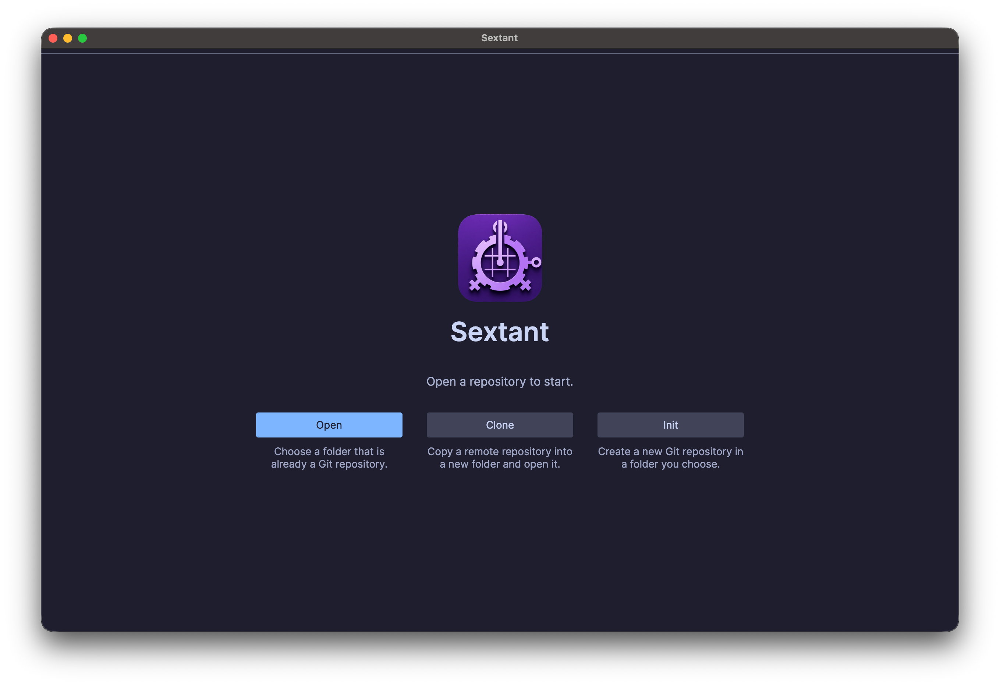
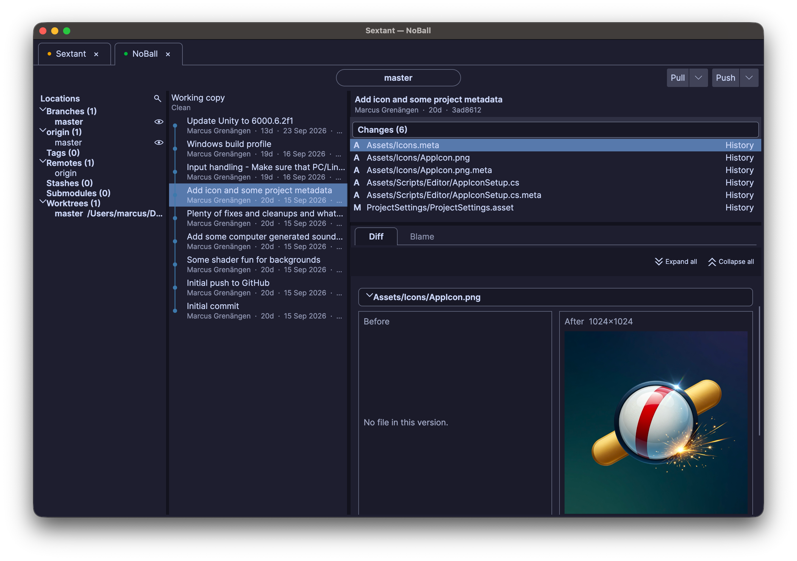
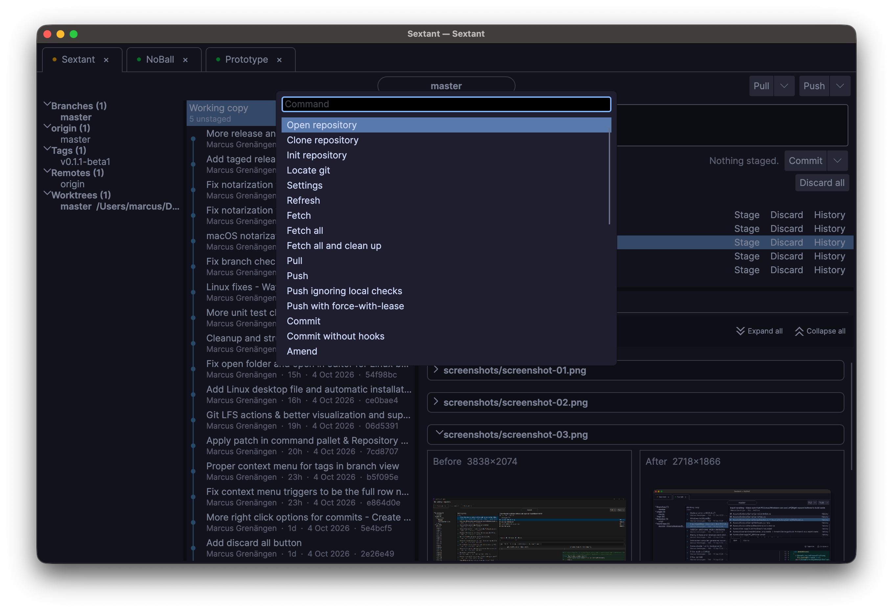
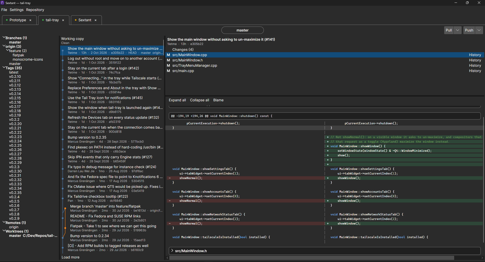
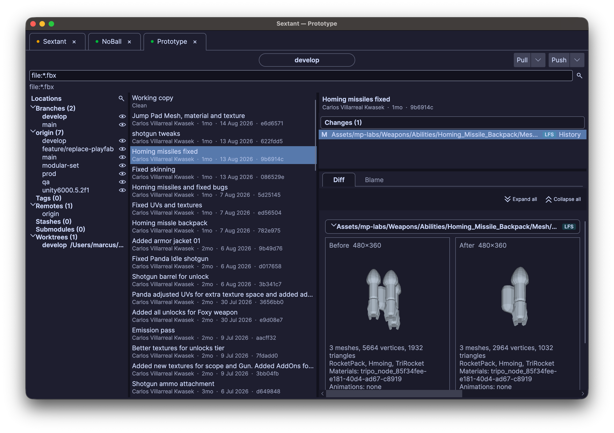

<p align="center">
  
</p>

<h1 align="center">Sextant</h1>

<p align="center"><strong>The Git UI I want to use.</strong></p>

<p align="center">
  A Git client for very large repositories. 
  Fast where it counts, and a little help when the task gets fiddly.
</p>
It talks only to the `git` already on your machine, so your config, hooks, attributes, and credential helper stay the ones you set up in the terminal.

The guides are in the [documentation](docs/README.md): installing and updating, settings (including formatted JSON diffs), and day-to-day use.

## Built with large git repos in mind

Status, history, and the file list ask git for a slice and paint what is on screen. A slow status can offer two local settings, `feature.manyFiles` and `core.fsmonitor`, written to that repository only after you accept them.

## Screenshots










PNG, JPG, TIFF, SVG, and FBX changes open as a preview. An FBX diff shows both models. Hold Ctrl or Cmd to interact with FBX files such as rotating, zooming etc. Ctrl or Cmd + double click will restore the view to it's original.

## Build & Run Locally

You need the [.NET 10 SDK](https://dotnet.microsoft.com/download) and `git` on `PATH`. Sextant runs on Windows, Linux, and macOS, and the window follows the system light or dark theme.

```bash
dotnet run --project src/Sextant.csproj
```

```bash
dotnet test Sextant.slnx
```

That command builds the shared tests and the tests for the operating system you are on. Windows tests compile on Windows, Linux tests on Linux, and macOS tests on macOS.

To produce a _baked binary release_ you need to run (from the src folder):
```bash
dotnet publish
```

On macOS the build is a `Sextant.app` bundle.

On Linux a published build includes `sextant.desktop` and the sextant mark beside the executable. The first launch copies that desktop file into `~/.local/share/applications` (or `$XDG_DATA_HOME/applications`) when it is not already there, and sets the executable to the path that was launched.
